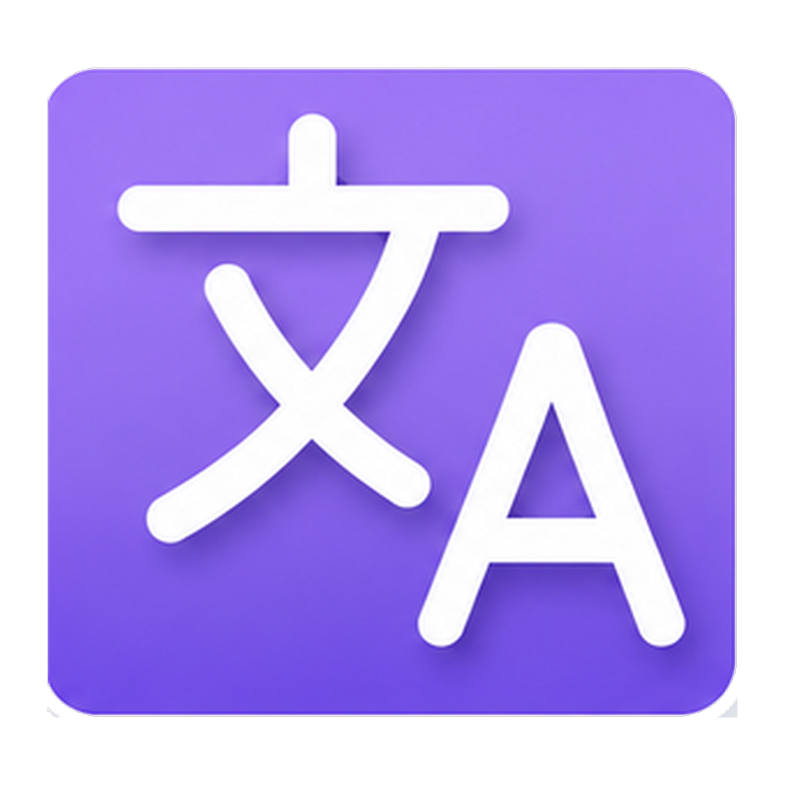

<div align="center">
  
  <h1>Ren'Py Translation Studio</h1>

[](https://github.com/lambda-vn/renpy-translation-studio/releases/latest)
[](https://github.com/lambda-vn/renpy-translation-studio/actions/workflows/ci.yml)
[](https://github.com/lambda-vn/renpy-translation-studio/actions/workflows/build.yml)
[](LICENSE.md)
[](https://www.python.org/downloads/)
[](https://github.com/lambda-vn/renpy-translation-studio/releases/latest)

</div>

Application desktop de gestion des traductions pour jeux Ren'Py. Elle couvre le
workflow complet : extraction des textes du jeu, révision ligne par ligne dans
une interface dédiée, traduction automatique via des fournisseurs MT/LLM,
réécriture des fichiers `tl/`, puis export d'un zip prêt à livrer.

Version anglaise : [README.md](README.md).


La documentation complète, écran par écran, est dans
[`docs/fr/`](docs/fr/README.md) ([English](docs/en/README.md)).

## Fonctionnalités

- Extraction des textes traduisibles d'un jeu Ren'Py via le moteur embarqué
  dans le jeu (`renpy translate`), à défaut via un SDK Ren'Py installé.
- Interface de révision ligne par ligne avec statuts : `not_translated`,
  `draft`, `imported`, `ai_suggested`, `human_validated`. Une ligne
  `human_validated` n'est jamais écrasée par une suggestion IA. Toute ligne
  peut aussi être marquée à revoir et porter une note expliquant pourquoi.
- Jobs de traduction en arrière-plan avec contrôles qualité par ligne
  (variables, balises `{tag}`, longueur) et retries automatiques en cas
  d'échec. La progression s'affiche dans un bandeau et non dans une modale :
  la révision reste utilisable pendant qu'un job tourne.
- Glossaire des personnages et résumé d'univers généré par IA, pour donner un
  contexte cohérent aux fournisseurs.
- Import et export de fichiers bilingues en CSV, XLIFF 1.2 ou JSON, pour une
  relecture dans un tableur ou un outil de TAO. L'appariement se fait par
  identifiant de bloc stable, jamais par position.
- Mémoire de traduction commune à tous les projets, alimentée par les seules
  validations humaines, qui remplit les correspondances exactes d'un nouveau
  projet.
- Utilisable entièrement au clavier, F1 listant les raccourcis. Les statuts
  portent un glyphe et un libellé pour lecteur d'écran, jamais la couleur
  seule.
- Export zip limité à `<jeu>/game/tl/<langue>/`.

## Fournisseurs de traduction

| Fournisseur | Type | Tourne | Demande | Notes |
|---|---|---|---|---|
| [DeepL](https://www.deepl.com) | MT | Cloud | Clé API | Gère un glossaire côté serveur |
| [LibreTranslate](https://libretranslate.com) | MT | Cloud ou auto-hébergé | URL, clé si l'instance en réclame une | Une requête par unité |
| [Ollama](https://ollama.com) | LLM | Local, ou modèles cloud d'Ollama | Un modèle téléchargé et un GPU pour être à l'aise ; un modèle `-cloud` demande `ollama signin` à la place | Garde-fous pour petits modèles quantifiés |
| [Claude](https://www.anthropic.com) | LLM | Cloud | Clé API | Bêta : jamais testé contre l'API réelle |
| [Mistral](https://mistral.ai) | LLM | Cloud | Clé API | Bêta : jamais testé contre l'API réelle |

Les modèles cloud d'Ollama passent par le même endpoint local, le démon
signant lui-même la requête : rien ne change ici, hormis le nom du
modèle saisi dans les paramètres.

Ni compte ni GPU du tout : le serveur MCP ci-dessous confie la
traduction à un assistant que vous payez déjà.

## Serveur MCP

L'application expose aussi ses projets via le
[Model Context Protocol](https://modelcontextprotocol.io), pour qu'un
assistant comme Claude Code fasse la traduction avec un abonnement que
vous avez déjà, plutôt qu'avec une clé API ou un GPU local.

Depuis une archive publiée, le lanceur est à côté de l'application :

```bash
claude mcp add renpy-studio -- /chemin/vers/renpy-translation-studio/rts-mcp
```

Sous Windows, c'est `rts-mcp.cmd`. Depuis un clone de ce dépôt :

```bash
claude mcp add renpy-studio -- uv run --directory /chemin/vers/renpy-translation-studio python -m mcp_server
```

Le serveur est un processus à part, lancé par le client et non par
l'application, qui n'a donc pas besoin d'être ouverte. Les deux ne se
rejoignent que par la base du projet.

Demandez-lui la liste de vos projets, choisissez-en un, et faites-lui
traduire un fichier. Il dispose des mêmes actions que l'écran de
révision : recherche et filtres, glossaire des personnages, résumé
d'univers, mémoire de traduction, notes et marquage à revoir. Ce qu'il
renvoie passe par les mêmes contrôles qualité et arrive en
`ai_suggested`, à relire dans l'application comme toute autre
suggestion.

Laissez l'écran de révision ouvert pendant qu'il travaille et les
lignes se remplissent sous vos yeux : le serveur dit à l'application
lesquelles il vient d'écrire, et ces lignes-là sont mises à jour sur
place. Fermez l'application et il continue de traduire, la notification
étant un bonus et non une dépendance.

Deux choses lui restent interdites sauf mention explicite sur la ligne
de commande : `--allow-overwrite-validated` autorise une soumission à
remplacer une ligne que vous avez validée, en la faisant retomber en
brouillon ; `--allow-clear` autorise l'effacement en masse. Ce sont des
drapeaux et non des arguments d'outil à dessein : l'assistant lit le
texte du jeu, donc une réplique réclamant l'un ou l'autre ne doit pas
être une demande qu'il puisse s'accorder lui-même. Il n'ouvre par
ailleurs que des jeux déjà configurés dans l'application, jamais un
dossier arbitraire.

## Stack

Python 3.12+ / Flet (interface desktop Flutter) / uv / SQLite.

## Prérequis

- Python 3.12 ou plus récent.
- [uv](https://docs.astral.sh/uv/) pour la gestion des dépendances et de
  l'environnement.
- Un moteur Ren'Py pour lancer l'extraction. Un jeu packagé embarque le sien,
  dans la version pour laquelle ses sources ont été écrites, et c'est celui-là
  qui est utilisé quand ce système peut l'exécuter : un build `-win` ne
  contient que des runtimes Windows, donc un jeu Windows extrait depuis Linux
  a besoin du recours ci-dessous. Cela exécute du code tiers, l'exécutable même
  que vous lanceriez pour jouer.
- Le SDK Ren'Py, facultatif. C'est le recours pour un jeu n'embarquant aucun
  moteur exécutable sur ce système, et sa version peut différer de celle du
  jeu : Ren'Py 8 refuse une syntaxe d'écran que Ren'Py 7 acceptait, et perd
  alors les lignes de chaque source refusée.
- Un compte ou un endpoint fournisseur (clé API ou serveur local) pour le
  fournisseur que vous comptez utiliser.

## Installation

```bash
git clone https://github.com/lambda-vn/renpy-translation-studio.git
cd renpy-translation-studio
uv sync
```

`uv` crée le `.venv` automatiquement au premier `uv sync` ou `uv run`. Ne
l'activez pas manuellement et ne le committez pas. N'appelez jamais `pip`
directement.

## Lancement

```bash
uv run flet run src/main.py
```

Au premier lancement, un écran d'onboarding demande la langue de l'interface
et, facultativement, le chemin du SDK Ren'Py. Vous pointez ensuite l'application vers un dossier
de jeu, choisissez les langues source et cible, puis passez à la révision,
la traduction et l'export.

## Développement

Après chaque modification, les quatre contrôles doivent passer :

```bash
uv run ruff check
uv run ruff format --check
uv run mypy src/
uv run pytest
```

- `ruff` gère le lint et le formatage (remplace black, flake8, isort).
- `mypy` tourne en mode strict ; tout le code est typé statiquement.
- `pre-commit install` installe les hooks de formatage, lint et message de
  commit.

### Tests

Tests unitaires uniquement, pas de tests Flet ni end-to-end. Les fournisseurs
sont testés contre des clients mockés, jamais les vraies APIs. Les fixtures
`.rpy` dans `tests/fixtures/` sont de vrais extraits Ren'Py.

```bash
uv run pytest
uv run pytest tests/test_parser.py -v
```

### Compiler un binaire desktop

```bash
uv run python scripts/build.py
```

Compile pour le système qui l'exécute : `flet build` pilote la chaîne
Flutter locale et ne compile pas en croisé. Les trois cibles sont
produites par le workflow Build, un runner chacune. macOS est en arm64
seulement, une de ses dépendances ne pouvant pas être compilée en croisé
sur un runner Apple Silicon. Les binaires ne sont pas signés, donc
SmartScreen et Gatekeeper avertiront.

## Structure du projet

```
src/
  main.py            Point d'entrée Flet et navigation entre vues
  app/               UI : état, thème, composants, vues
  core/              Logique métier
    renpy/           parseur, wrapper CLI du SDK, writer, détecteur de personnages
    storage/         base SQLite, repositories, projets récents
    translation/     job, qualité, context builder, fournisseurs
  mcp_server/        serveur MCP exposant un projet à un assistant
  locales/           en.json et fr.json (i18n de l'UI)
tests/               Tests unitaires et fixtures .rpy
```

Voir [CLAUDE.md](CLAUDE.md) pour l'architecture complète et les notes
contributeur.

## Sécurité

- Les appels subprocess utilisent toujours une liste d'arguments, jamais
  `shell=True`.
- Les chemins utilisateur sont résolus et bornés ; les entrées du zip rejettent
  les traversées `../`.
- Les clés API vivent dans les settings locaux et ne sont jamais journalisées
  ni incluses dans un message d'erreur.
- L'envoi de contenu du jeu à un service tiers (résumé d'univers par IA)
  demande toujours une confirmation explicite de l'utilisateur.
- Une traduction est refusée si elle ajoute une `[interpolation]` absente du
  texte source. Ren'Py évalue le contenu des crochets comme une expression
  Python : une interpolation introduite par une traduction venue de
  l'extérieur (fichier bilingue renvoyé par un relecteur, réponse d'un
  fournisseur) s'exécuterait chez tous les joueurs du jeu livré.

## Commits

Conventional Commits, validés par pre-commit. Voir
[COMMIT_CONVENTION.md](COMMIT_CONVENTION.md) pour les types, scopes et
exemples.

## Licence

Sous licence CeCILL v2.1, une licence libre française compatible avec la GNU
GPL. Voir [LICENSE.md](LICENSE.md).

## Avertissement

Ren'Py Translation Studio n'est pas affilié, ni approuvé, ni sponsorisé par
Ren'Py. Le nom sert uniquement à désigner le moteur dont cet outil lit et écrit
les fichiers.
