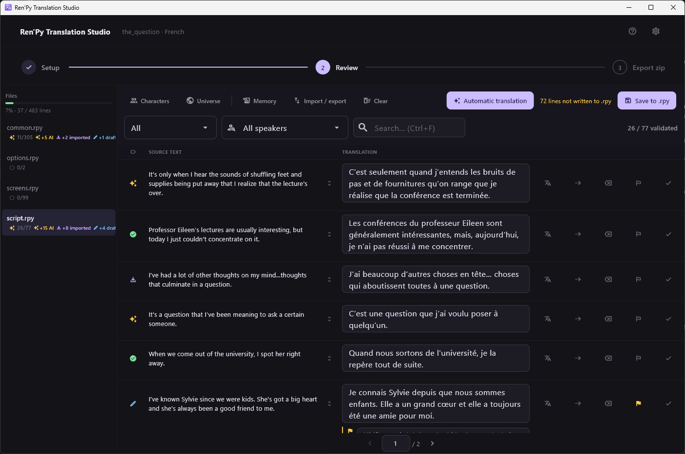

[← Ren'Py Translation Studio](../../README.md)

# Ren'Py Translation Studio

*[Version française](../fr/README.md)*

Desktop application for translating Ren'Py games. It covers the whole
trip: pull the text out of a game, review it line by line, have a machine
translation service or an LLM draft the rest, write the `tl/` files back,
and ship a zip.

## Start here

| Page | What it covers |
|---|---|
| [Installation](installation.md) | Getting the application running, and what it needs |
| [Project setup](project-setup.md) | Pointing it at a game and extracting the text |
| [Review screen](review-screen.md) | The screen you will spend your time in |
| [Translation statuses](translation-statuses.md) | What the five statuses mean and who may change them |

## Translating

| Page | What it covers |
|---|---|
| [Translation providers](translation-providers.md) | DeepL, Ollama, LibreTranslate, Claude, Mistral |
| [MCP server](mcp-server.md) | Letting an assistant you already pay for do the translating |
| [Context for the AI](context-for-the-ai.md) | Character glossary and universe summary |
| [Bilingual files](bilingual-files.md) | CSV, XLIFF and JSON round trips, and the translation memory |

## Finishing

| Page | What it covers |
|---|---|
| [Export](export.md) | Writing the `.rpy` files and building the zip |
| [Keyboard shortcuts](keyboard-shortcuts.md) | Every shortcut, and what is reachable without a mouse |
| [Troubleshooting](troubleshooting.md) | Extraction failures, provider errors, suspicious translations |

## What the screenshots show

Every screenshot in these pages was taken on **The Question**, the sample
visual novel shipped with the Ren'Py SDK, translated into French. It is a
real extraction of a real game, not a mock-up.

## License and scope

The application is released under the
[CeCILL v2.1](../../LICENSE.md)
free software license. It is not affiliated with, endorsed by, or
sponsored by Ren'Py; the name only designates the engine whose files it
reads and writes.
