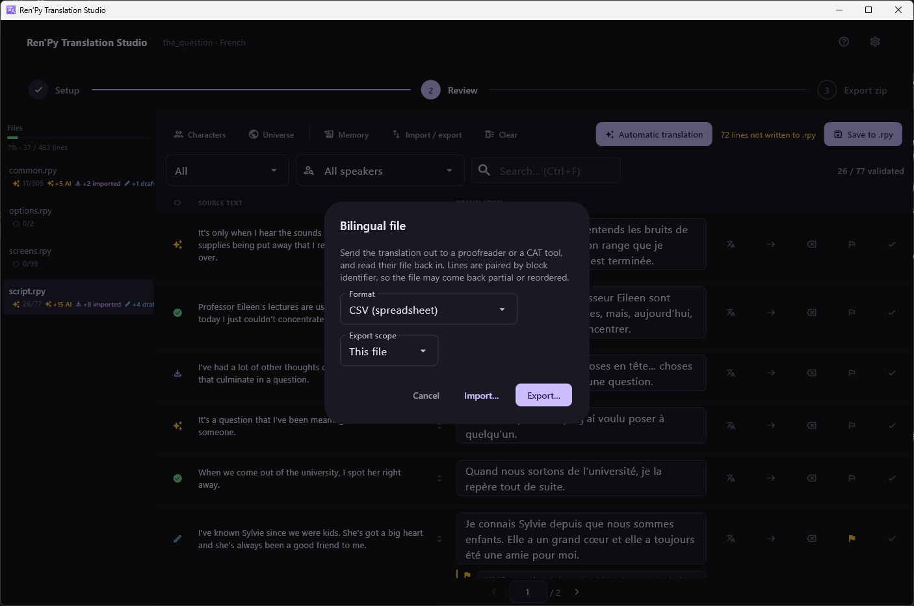

[← Documentation](README.md)

# Bilingual files

*[Version française](../fr/bilingual-files.md)*

Two ways to move translations in and out without touching the game files:
a file you send to someone, and a memory shared between your own projects.

## Import and export

Reached from **Import / export** in the review toolbar, or from a single
file's right-click menu.

| Format | For |
|---|---|
| **CSV** | A spreadsheet. The format a proofreader without special tools will accept. |
| **XLIFF 1.2** | A CAT tool — OmegaT, memoQ, Trados. |
| **JSON** | A script of your own. |

**Export scope** is either the file you are looking at or the whole
project.

### Coming back

Lines are paired by **block identifier**, never by position. That has one
consequence worth relying on: the file may come back **partial or
reordered** and it will still import correctly. A proofreader may delete
the rows they had nothing to say about, sort the sheet by speaker, or
send back only the first chapter.

Everything that arrives lands as **imported**, because it has not been
read *here*. Validated lines are left alone.

> An imported file is untrusted input. Every line goes through the same
> quality checks as a provider's answer, and one that adds a Ren'Py
> `[interpolation]` the source did not have is refused outright — see
> [Troubleshooting](troubleshooting.md).

## Translation memory

The **Memory** button fills untranslated lines from a store shared by
every project on this machine.

- It is fed by **human validations only**. Nothing a provider suggested
  goes in until you have said yes to it.
- It answers on **exact source matches** for a language pair, not fuzzy
  ones.
- It fills **the whole project**, never a single file: the memory answers
  for a language pair, and a per-file scope would just make you walk every
  file to reach the same result.
- It only ever touches `not_translated` lines, so it needs no
  confirmation, and what it writes lands as **imported**.

It pays off from the second game in a series onward, and on the interface
strings of `screens.rpy` and `common.rpy`, which are nearly identical
across games.

The settings dialog says how much it currently holds.
