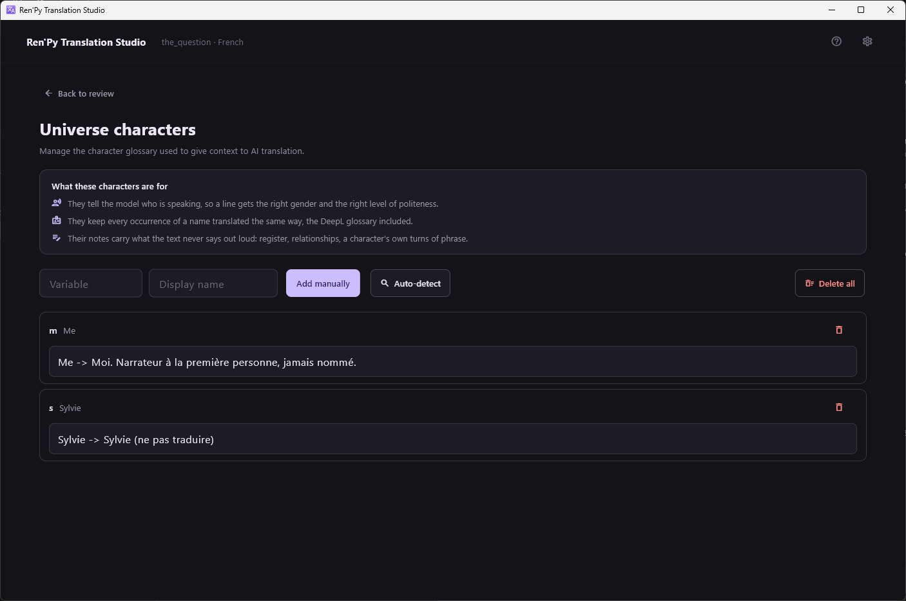
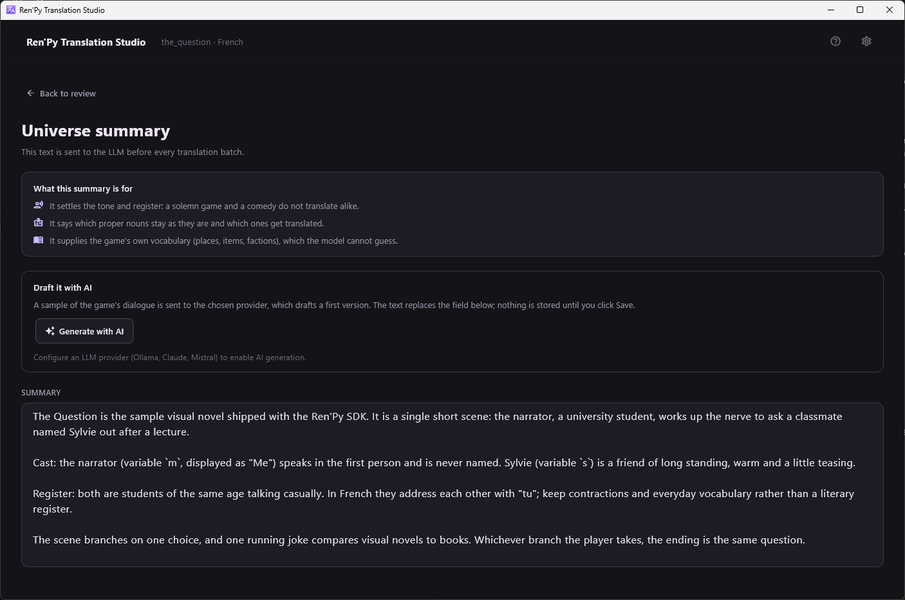

[← Documentation](README.md)

# Context for the AI

*[Version française](../fr/context-for-the-ai.md)*

Two screens feed the LLM providers what the text alone cannot tell them.
Both are reached from the review toolbar, and both are worth ten minutes
before starting a long translation job.

## Character glossary



**Auto-detect** scans the game's `.rpy` sources for `Character()`
definitions and fills the list. It is a heuristic scan, so read what it
found. Running it again overwrites display names with whatever the source
says, but leaves your notes alone.

Each entry has a variable (`s`), a display name (`Sylvie`) and a free-form
note. The notes do the real work:

```
Sylvie -> Sylvie (do not translate)
Me -> Moi. First-person narrator, never named.
```

They are used three ways:

- They tell the model **who is speaking**, so a line lands with the right
  gender and the right level of politeness.
- They keep a name **translated the same way everywhere**. With DeepL,
  notes written as `Name -> Translation` become an actual server-side
  glossary.
- They carry **what the text never says out loud**: register,
  relationships, a character's own turns of phrase.

## Universe summary



Free text, sent to the LLM before every batch. Three things belong in it:

- **The tone and register.** A solemn game and a comedy do not translate
  alike, and a batch of ten disconnected lines gives the model no way to
  tell which one it is looking at.
- **Which proper nouns stay as they are** and which get translated.
- **The game's own vocabulary** — places, items, factions — which no model
  can guess.

**Generate with AI** sends a sample of the game's dialogue to the
configured LLM provider and drafts a first version. It replaces the field;
nothing is stored until you press Save. The button is disabled until an
LLM provider is configured, since machine translation services cannot do
it.

> Generating sends game text to a third-party service, and the
> application asks you to confirm that every time.

### About a terms glossary

There is no separate glossary of terms beyond characters, on purpose: no
measured need justified one yet. If you want recurring terminology
respected, write it into the universe summary — it already goes into the
system prompt of all three LLMs.
