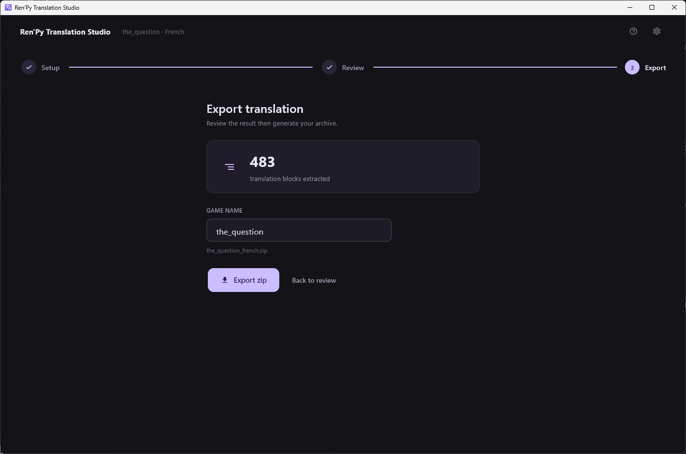

[← Documentation](README.md)

# Export

*[Version française](../fr/export.md)*

Two distinct steps: writing the `.rpy` files, then packing them into a zip.

## Writing the .rpy files

**Save to .rpy** in the review toolbar. The orange counter beside it says
how many edits exist only in the database so far.

The writer rewrites `game/tl/<language>/`, matching dialogue blocks by
their Ren'Py **block identifier** and `strings` blocks by their `old`
text — never by position. Files are backed up before being modified.

This is the step that makes the translation real: everything before it
lives in `<game>/.rts/translations.db`, which Ren'Py knows nothing about.
Every line that has text is written, whatever its
[status](translation-statuses.md).

## The zip

Reached from the **third step of the progress bar**, at the top of the
review screen. The first two steps lead back, that one leads forward.



The archive has the layout a player expects to drop into a game:

```
<game name>/game/tl/<language>/
```

**Game name** is read from `build.name` in the game's `options.rpy`,
falling back to the folder name, and sanitised so it is safe in a path.
The proposed file name is shown under the field.

`.rpyc` files are excluded — those are Ren'Py's compiled output and the
engine regenerates them. Any entry whose path contains `../` is refused
rather than written.

Leaving the review is refused while a translation job is running, so
cancel it or let it finish before exporting.

## Sending it out

The generated `tl/` folder ships to the game's players, which is why
[quality checks](troubleshooting.md) on interpolations are refusals rather
than warnings: Ren'Py evaluates whatever sits between square brackets as a
Python expression.
