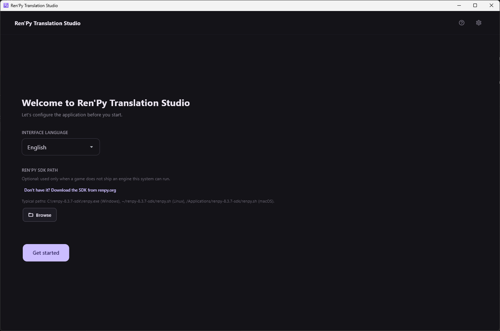
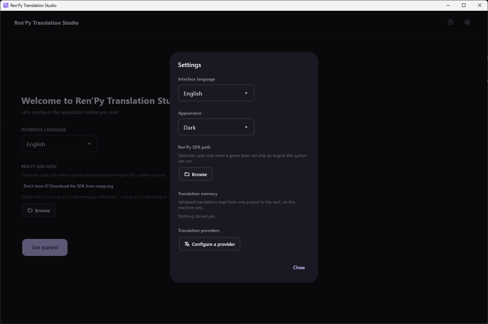

[← Documentation](README.md)

# Installation

*[Version française](../fr/installation.md)*

## What you need

- **Python 3.12 or newer.**
- **[uv](https://docs.astral.sh/uv/)**, which manages the dependencies and
  the virtual environment. Never call `pip` directly in this project.
- **A Ren'Py engine to extract with.** Usually you already have one: see
  below.
- **A provider account or endpoint**, only if you want machine or LLM
  translation. The application is perfectly usable as a plain review tool
  without any.

### About the Ren'Py engine

Extraction runs Ren'Py's own `translate` command, so something has to
provide that command. Two sources, in this order:

1. **The engine the game ships with.** A packaged Ren'Py game carries its
   own engine, in the exact version its sources were written for. That is
   the right one by construction, and it is used whenever this system can
   run it.
2. **A Ren'Py SDK you installed**, as a fallback. Needed when the game's
   own engine cannot run here — a `-win` build opened from Linux, for
   instance, since it only contains Windows runtimes.

The SDK is therefore **optional**. Set it later, from the settings dialog,
if a game ever asks for it.

> Version matters. Ren'Py 8 rejects screen syntax that Ren'Py 7 accepted,
> and every source file it refuses takes its lines out of the extraction.
> Measured on one real game: the SDK 8.5.3 rejected 3 sources and produced
> 40 739 units, while the game's own 7.5.3 engine rejected none and
> produced 40 820.

> Running the game's engine means running third-party code — the same
> executable you would launch to play. Only extract games you would be
> willing to run.

## Install

```bash
git clone https://github.com/lambda-vn/renpy-translation-studio.git
cd renpy-translation-studio
uv sync
```

`uv` creates `.venv` at the root on the first `uv sync` or `uv run`. Do not
activate it by hand and do not commit it.

## Run

```bash
uv run flet run src/main.py
```

## First launch



Two things are asked, and both can be changed later:

- **Interface language** — English or French.
- **Ren'Py SDK path** — optional, as explained above. Leave it empty
  until a game needs it.

Everything else is set from the gear icon in the top-right corner, on
every screen.



The **Appearance** setting switches between dark, light and following the
system, and applies immediately. API keys are not stored in this file:
they go to the operating system's keyring.

## A packaged binary instead

Builds for Windows, macOS and Linux are produced by the repository's
**Build** workflow, one runner per target, and published as artifacts.
That is the normal way to get a packaged application; building locally
with `uv run python scripts/build.py` only ever builds for the system it
runs on, since `flet build` does not cross-compile.

Those binaries are unsigned, so SmartScreen and Gatekeeper will warn about
them.
