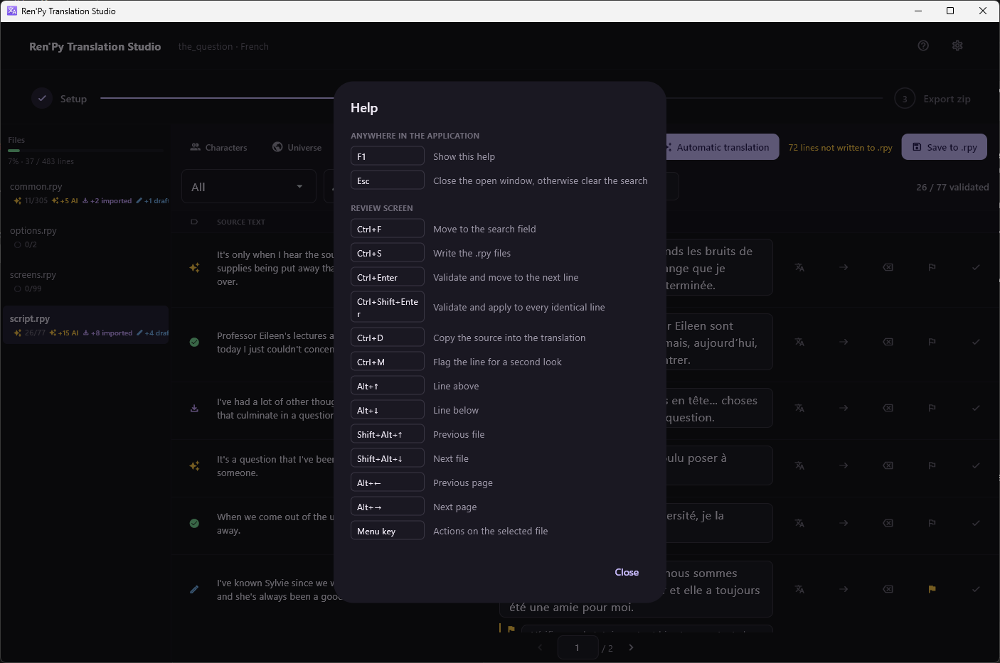

[← Documentation](README.md)

# Keyboard shortcuts

*[Version française](../fr/keyboard-shortcuts.md)*

`F1` shows this list inside the application, on any screen.

## Anywhere

| Key | Action |
|---|---|
| `F1` | Show the shortcut list |
| `Esc` | Close the open dialog, otherwise clear the search |

## Review screen

| Key | Action |
|---|---|
| `Ctrl+F` | Move to the search field |
| `Ctrl+S` | Write the `.rpy` files |
| `Ctrl+Enter` | Validate and move to the next line |
| `Ctrl+Shift+Enter` | Validate and apply to every identical line |
| `Ctrl+D` | Copy the source into the translation |
| `Ctrl+M` | Flag the line for a second look |
| `Alt+↑` / `Alt+↓` | Line above / below |
| `Shift+Alt+↑` / `Shift+Alt+↓` | Previous / next file |
| `Alt+←` / `Alt+→` | Previous / next page |
| `Menu` key | Actions on the selected file |

## Notes

`Ctrl+Shift+Enter` is the one to remember on a game full of repeated
one-liners — a `"..."`, a `"Yes."`, a menu label that appears in twenty
places.

The shortcuts fire even while a text field has focus, so you never have to
leave the translation you are typing to validate it.

The whole application is operable from the keyboard, and statuses carry a
distinct glyph and a screen-reader label rather than relying on colour.
