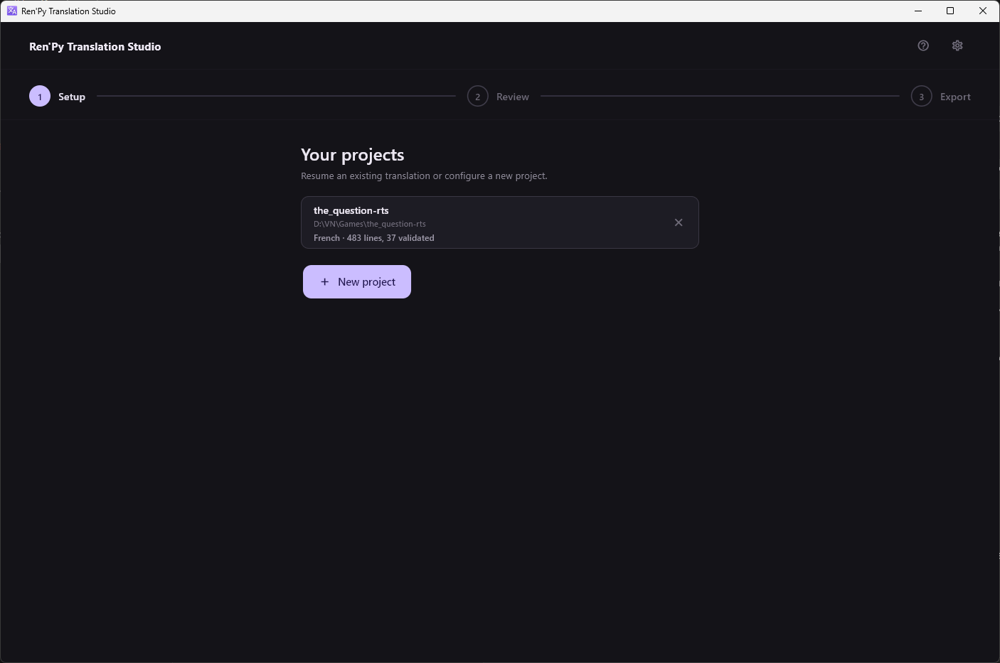
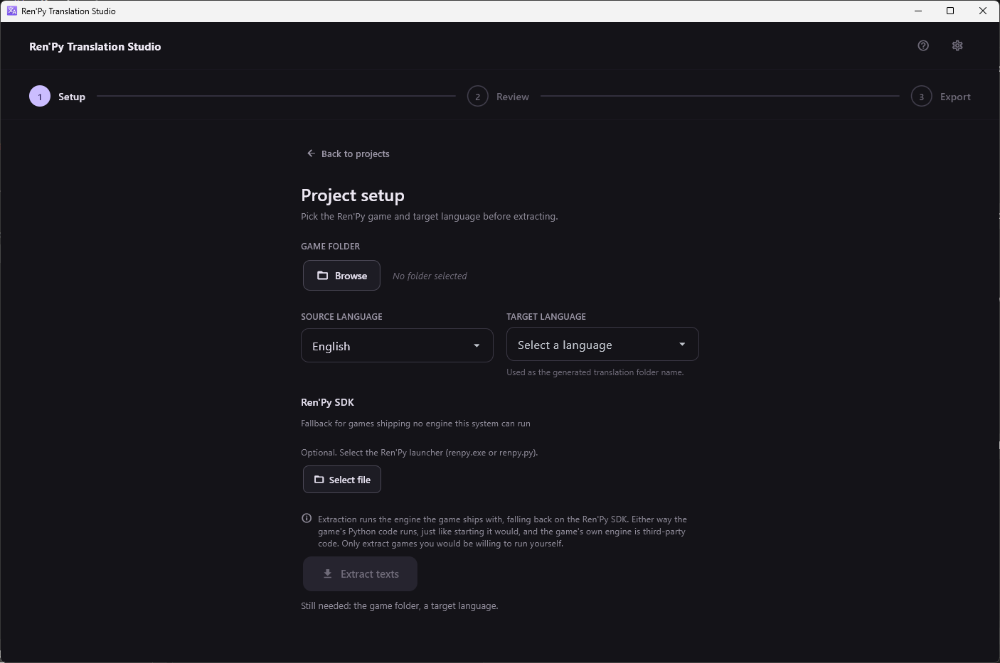

[← Documentation](README.md)

# Project setup

*[Version française](../fr/project-setup.md)*

The first screen after launch. It either lists the games you already set
up, or offers the form to add one.

## Your projects

Each entry shows the folder name, its path, the target language and how
far along it is. Clicking one reopens it straight in the review screen,
with the file, page, filter and search you left it on.

The × removes the entry from the list. It does not touch the game folder
or the translations stored inside it, and re-adding the folder finds them
again.

This list is also what the [MCP server](mcp-server.md) is allowed to open: a
folder that is not in it cannot be reached by an assistant.

## A new project

**Game folder** — the root of the Ren'Py game, the folder *containing*
`game/`, not `game/` itself.

**Source language** — the language the game is written in. English in
almost every case.

**Target language** — the language you are translating into. This is also
the name of the folder Ren'Py will generate, `game/tl/<language>/`, so it
has to be a language Ren'Py knows.

**Ren'Py SDK** — optional. Only used when the game ships no engine this
system can run. See [Installation](installation.md).

## Extraction

**Extract texts** runs Ren'Py's own `translate` command in a subprocess.
Ren'Py walks the game's scripts and writes `game/tl/<language>/`, and the
application reads those files back and stores one row per translatable
block in `<game>/.rts/translations.db`.

Expect it to take a while on a large game — it is the game's engine
parsing the whole script, not a text search.

### What can go wrong

- **A source file is rejected.** Ren'Py reports a parse error and the
  lines of that file are simply absent from the extraction. The
  application names the files that were refused. This is the classic
  symptom of a Ren'Py 8 SDK reading a Ren'Py 7 game.
- **No engine at all.** Neither the game's own engine nor a configured SDK
  can run here. The message names which of the two was missing.

### Re-extracting

Re-running extraction on a project that already has one **never
overwrites your work**. Blocks are matched by their stable Ren'Py
identifier, new ones are added, and existing translations stay where they
are. Lines whose source text changed in the game are re-synchronised, and
only their unreviewed translations are dropped — anything you validated
is kept and flagged for you to look at again.

## Where things are stored

| What | Where |
|---|---|
| Translations, statuses, notes | `<game>/.rts/translations.db` (SQLite) |
| Generated Ren'Py files | `<game>/game/tl/<language>/` |
| Settings, project list, translation memory | The OS configuration directory |
| API keys | The OS keyring, never a file in the repo |

The database lives inside the game folder, so moving or copying that
folder carries the whole translation with it. It is opened in WAL mode,
which means a second window and the MCP server can work on the same
project at the same time; two sidecar files, `translations.db-wal` and
`-shm`, appear next to it.
