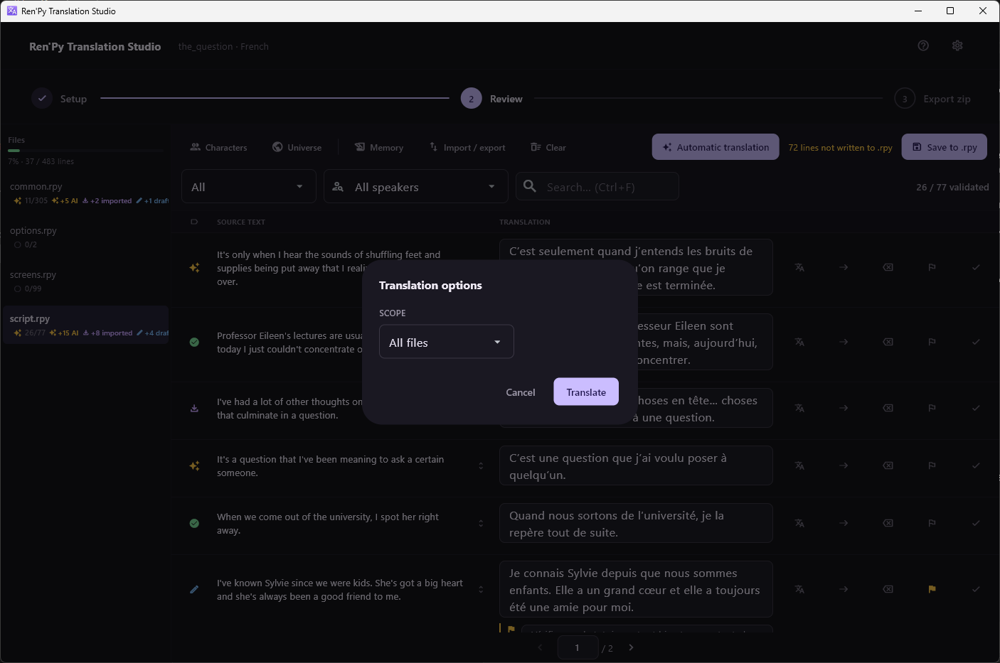

[← Documentation](README.md)

# Review screen

*[Version française](../fr/review-screen.md)*

Where the work happens. Everything else in the application is reached from
here.

## The file panel

On the left, one entry per `.rpy` file the extraction produced, with a
progress bar for the whole project above them.

Each file carries its counts: validated over total, then how many are AI
suggestions, imported, or drafts. A file at `0/99` has not been started;
`26/77` means twenty-six lines validated out of seventy-seven.

Right-clicking a file, or pressing the **Menu** key while it is selected,
offers six actions on that file alone: open it, copy its path, reveal it
in the file manager, translate it, send it out as a
[bilingual file](bilingual-files.md), or clear its translations.

`common.rpy` is usually the largest file and the least interesting: it
holds Ren'Py's own interface strings rather than the game's dialogue.

## Filters

**Status** filters the rows. Beyond the five statuses it offers two extra
views: *Flagged*, for lines someone marked for a second look, and *In
error*, for lines a quality check refused.

**Speakers** filters by character, using the variable names found in the
game's scripts. Useful to keep one character's register consistent, or to
translate all of one person's lines in a row.

**Search** (`Ctrl+F`) matches both the source and the translation, so it
finds a term you used as well as a term you are looking to translate.
`%` and `_` are searched literally.

The count on the right — `26 / 77 validated` — always describes the
current file, not the filter.

## The rows

Each row is one translatable block: its status glyph, the speaker, the
source text, and the field you type into.

The five icons on the right, in order:

| Icon | Action | Shortcut |
|---|---|---|
| Translate | Translate this line alone with the configured provider | |
| Arrow | Copy the source text into the translation | `Ctrl+D` |
| Erase | Clear the translation | |
| Flag | Mark the line for a second look | `Ctrl+M` |
| Check | Validate | `Ctrl+Enter` |

Validating with `Ctrl+Shift+Enter` also applies the same translation to
every other line whose source text is identical, which on a game full of
repeated one-liners saves a great deal of typing.

A flagged line can carry a **note**, shown under the field, in the yellow
band. Notes are for whatever the text does not say by itself: a register
to check, a term to keep consistent, a line whose meaning depends on a
branch. Neither the flag nor the note is ever touched by a translation
job or an import — only by a person.

Under a translation you may also see a **quality warning**, such as
*Translation 32% longer than source text*. Those are advisory. The
blocking ones are described in [Troubleshooting](troubleshooting.md).

## The toolbar

**Characters** and **Universe** open the two screens described in
[Context for the AI](context-for-the-ai.md).

**Memory** fills untranslated lines from the
[translation memory](bilingual-files.md#translation-memory).

**Import / export** does the [bilingual file](bilingual-files.md) round trip.

**Clear** deletes translations in bulk, with a confirmation.

**Automatic translation** starts a background job over the whole project
or the current file.

A running job reports in a banner rather than a modal, so the review stays
usable while it works. It only ever sends lines that are still
`not_translated`, which means fixing a bad suggestion by hand is safe: a
later job will not overwrite it, and will not retry it either.

**Save to .rpy** writes everything back into `game/tl/<language>/`. The
orange counter beside it — *72 lines not written to .rpy* — is how many
edits are only in the database so far. Nothing is lost if you leave
without saving; the files on disk are simply not up to date yet.

## Leaving

The progress bar at the top is the way out in both directions: the first
two steps go back to [project setup](project-setup.md), the third goes
forward to [export](export.md).

Going back to the setup screen asks for confirmation, and translations
stay saved either way. Navigation is refused while a translation job is
running: cancel it or let it finish.
