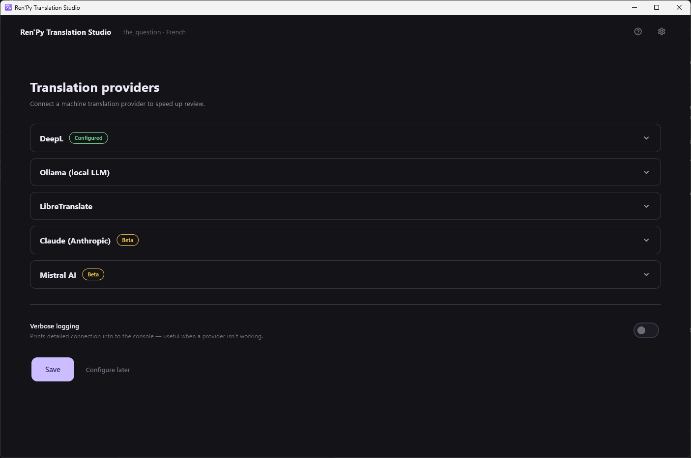
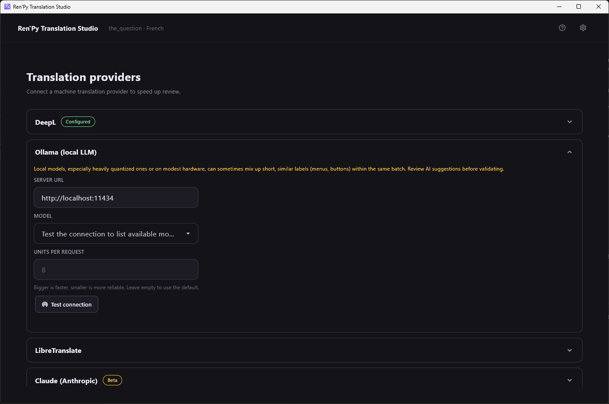

[← Documentation](README.md)

# Translation providers

*[Version française](../fr/translation-providers.md)*

Five providers, reached from the gear icon then **Configure a provider**.

| Provider | Type | Runs | Needs |
|---|---|---|---|
| [DeepL](https://www.deepl.com) | Machine translation | Cloud | API key |
| [Ollama](https://ollama.com) | LLM | Local, or Ollama's cloud models | A pulled model |
| [LibreTranslate](https://libretranslate.com) | Machine translation | Cloud or self-hosted | URL, key if the instance asks |
| [Claude](https://www.anthropic.com) | LLM | Cloud | API key |
| [Mistral](https://mistral.ai) | LLM | Cloud | API key |

A green **Configured** badge means a key or endpoint is stored. **Beta**
on Claude and Mistral means exactly what it says: those two have never
been tested against the real API.

**No provider at all is a valid setup.** The application is a review tool
first; the [MCP server](mcp-server.md) is the other way to get text
translated without an API key or a GPU.

## Machine translation or LLM

**DeepL and LibreTranslate** translate a string at a time. They are fast,
cheap and predictable, and they know nothing about your game: no
character register, no recurring terms, no idea who is speaking.

**Ollama, Claude and Mistral** receive the
[universe summary and character glossary](context-for-the-ai.md) with every
batch, so they can hold a register and keep a proper noun consistent. They
are slower and more expensive, and they can invent.

DeepL is the only one that supports a **server-side glossary**: character
notes written as `Name -> Translation` are uploaded as a real DeepL
glossary, synchronised lazily on the first batch.

Only the three LLMs can draft the [universe summary](context-for-the-ai.md)
for you.

## Ollama

**Server URL** — `http://localhost:11434` unless you moved it.

**Model** — press **Test connection** first; the dropdown then lists what
the daemon actually has. Ollama's cloud models go through the same local
endpoint, the daemon signing the request itself, so they are just another
name in that list; they need `ollama signin` rather than a key here.

**Units per request** — bigger is faster, smaller is more reliable. Leave
it empty for the default.

> The warning shown in that panel is not decorative. Heavily quantized
> local models, or modest hardware, genuinely do mix up short similar
> labels — menu entries, button captions — inside one batch. Reduce the
> batch size and review AI suggestions before validating them.

A local model needs a GPU to be comfortable. On CPU it will work and it
will be slow.

## API keys

Keys are stored in the **operating system keyring**, not in the settings
file and not in the repository. They are never logged, not even partially,
and never included in an error message.

## Verbose logging

The toggle at the bottom of the provider screen makes every provider log
its requests and responses at DEBUG level. It is the first thing to turn
on when a translation comes back wrong or a connection fails.

## Adding a provider

Providers implement a small structural protocol: `translate_batch()` and
`test_connection()`, with two optional capabilities — a server glossary,
and free-form completion for the universe summary. Adding one means a
module under `src/core/translation/providers/`, an entry in the registry,
its keys in the settings defaults, its section in the provider screen,
its label in the review screen, its strings in both locales, and a mocked
test file. See
[CLAUDE.md](../../CLAUDE.md).
