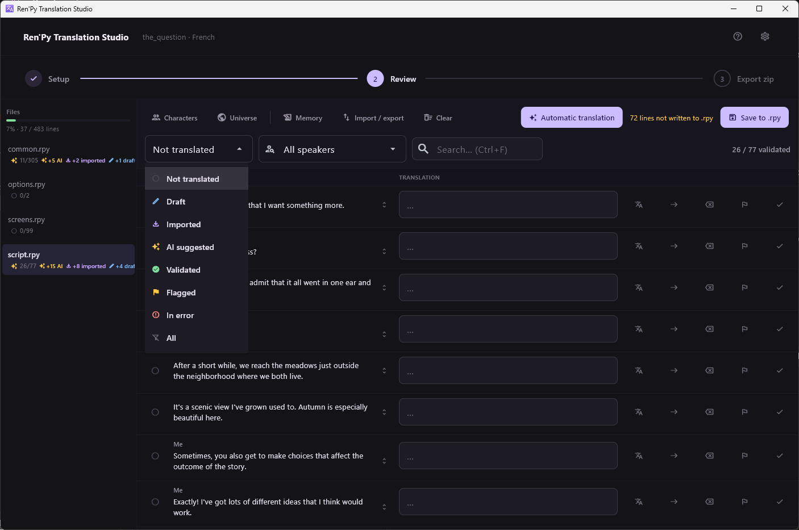
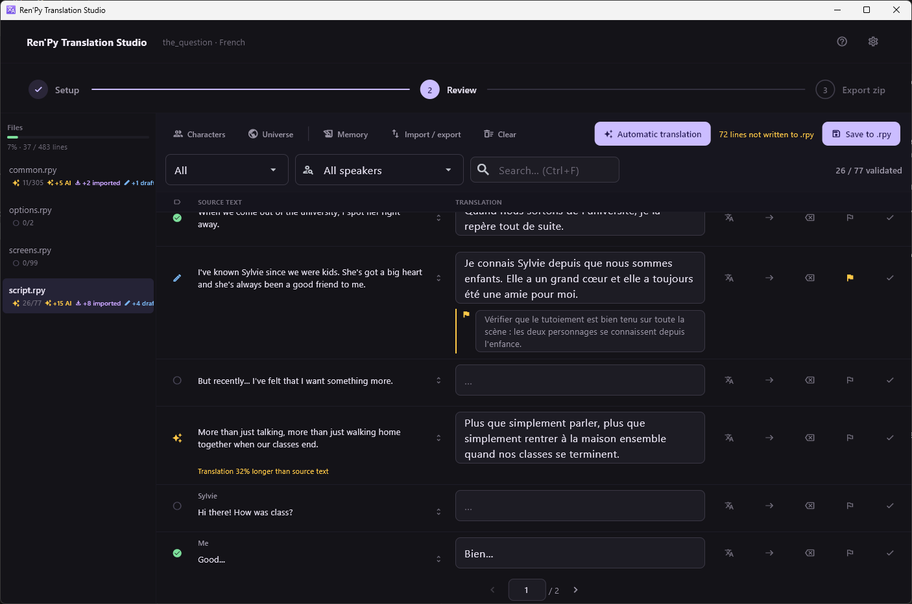

[← Documentation](README.md)

# Translation statuses

*[Version française](../fr/translation-statuses.md)*

Every line carries exactly one of five statuses, plus an independent flag.

## The five statuses

| Status | Meaning | Set by |
|---|---|---|
| **Not translated** | No translation yet | The extraction |
| **Draft** | Edited by hand, not validated | You, by typing |
| **Imported** | Came from elsewhere, unread here | Bilingual file import, translation memory |
| **AI suggested** | A provider or an assistant proposed it | A translation job, the MCP server |
| **Validated** | A human read it and said yes | You, `Ctrl+Enter` |

They are a pipeline, roughly `not_translated → ai_suggested →
human_validated`, with `draft` and `imported` as the two side entrances.

## The rules that matter

**A validated line is never overwritten.** Not by a translation job, not
by an import, not by the translation memory, not by a submission from the
MCP server. The only thing that can un-validate a line is you typing in
its field, which turns it into a draft.

**Jobs only touch untranslated lines.** A translation job sends nothing
else. So a wrong AI suggestion stays wrong until someone deals with it —
running the job again will not retry it. Clear it, or fix it, or filter on
*AI suggested* and go through them.

**Emptying a field resets the line.** A draft whose text you delete goes
back to `not_translated`, which puts it back in reach of the next job.

## Flag and note

Beside the status sits a **flag** — *look at this again* — and an optional
**note**. They are deliberately not statuses:

- They survive everything. A job, an import, a re-extraction: none of them
  clear a flag or a note.
- They are orthogonal to progress. A line can be flagged while
  untranslated, while validated, or anywhere between.
- Writing a note raises the flag automatically. Nothing lists notes on
  their own, so an unflagged note would be findable only by whoever
  remembered which line carried it.

Filter on *Flagged* to work through them.

## Where the statuses show up

- **In the file panel**, as the per-file counts.
- **In the row**, as the glyph in the left column. Each one has a
  distinct shape and a screen-reader label, so the information never
  depends on colour alone.
- **In the export**, indirectly: everything with text is written to the
  `.rpy` files, whatever its status. The statuses describe your confidence,
  not what ships.
