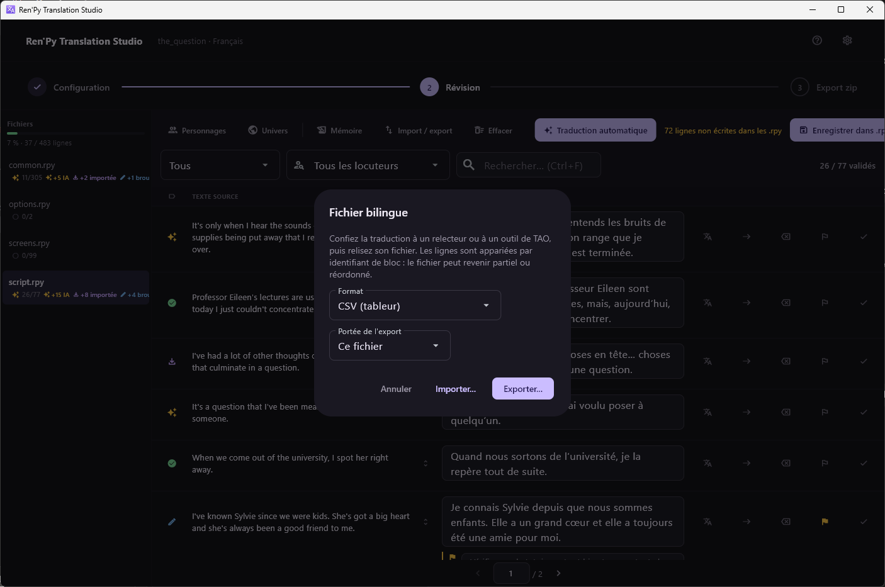

[← Documentation](README.md)

# Fichiers bilingues

*[English version](../en/bilingual-files.md)*

Deux façons de faire entrer et sortir des traductions sans toucher aux
fichiers du jeu : un fichier que vous envoyez à quelqu'un, et une mémoire
partagée entre vos propres projets.

## Import et export

Accessible depuis **Import / export** dans la barre d'outils de la
révision, ou depuis le menu contextuel d'un fichier.

| Format | Pour |
|---|---|
| **CSV** | Un tableur. Le format qu'un relecteur sans outil particulier acceptera. |
| **XLIFF 1.2** | Un outil de TAO — OmegaT, memoQ, Trados. |
| **JSON** | Un script à vous. |

**Étendue de l'export** : soit le fichier affiché, soit tout le projet.

### Le retour

Les lignes sont appariées par **identifiant de bloc**, jamais par position.
Cela a une conséquence sur laquelle on peut compter : le fichier peut
revenir **partiel ou réordonné** et s'importer quand même correctement. Un
relecteur peut supprimer les lignes sur lesquelles il n'avait rien à dire,
trier la feuille par locuteur, ou ne renvoyer que le premier chapitre.

Tout ce qui arrive prend le statut **importée**, parce que cela n'a pas été
relu *ici*. Les lignes validées sont laissées telles quelles.

> Un fichier importé est une entrée non fiable. Chaque ligne passe par les
> mêmes contrôles qualité que la réponse d'un fournisseur, et celle qui
> ajoute une `[interpolation]` Ren'Py absente de la source est refusée
> d'emblée — voir [Dépannage](troubleshooting.md).

## Mémoire de traduction

Le bouton **Mémoire** remplit les lignes non traduites depuis un stock
partagé par tous les projets de cette machine.

- Elle est alimentée **par les seules validations humaines**. Rien de ce
  qu'un fournisseur a suggéré n'y entre avant que vous ayez dit oui.
- Elle répond sur des **correspondances exactes** du texte source pour une
  paire de langues, pas sur des correspondances approchantes.
- Elle remplit **tout le projet**, jamais un seul fichier : la mémoire
  répond pour une paire de langues, et une portée par fichier ne ferait que
  vous obliger à parcourir chaque fichier pour arriver au même résultat.
- Elle ne touche que les lignes `non traduites`, elle n'a donc besoin
  d'aucune confirmation, et ce qu'elle écrit arrive en **importée**.

Elle devient payante à partir du deuxième jeu d'une série, et sur les
chaînes d'interface de `screens.rpy` et `common.rpy`, quasi identiques d'un
jeu à l'autre.

Le dialogue des paramètres indique ce qu'elle contient actuellement.
