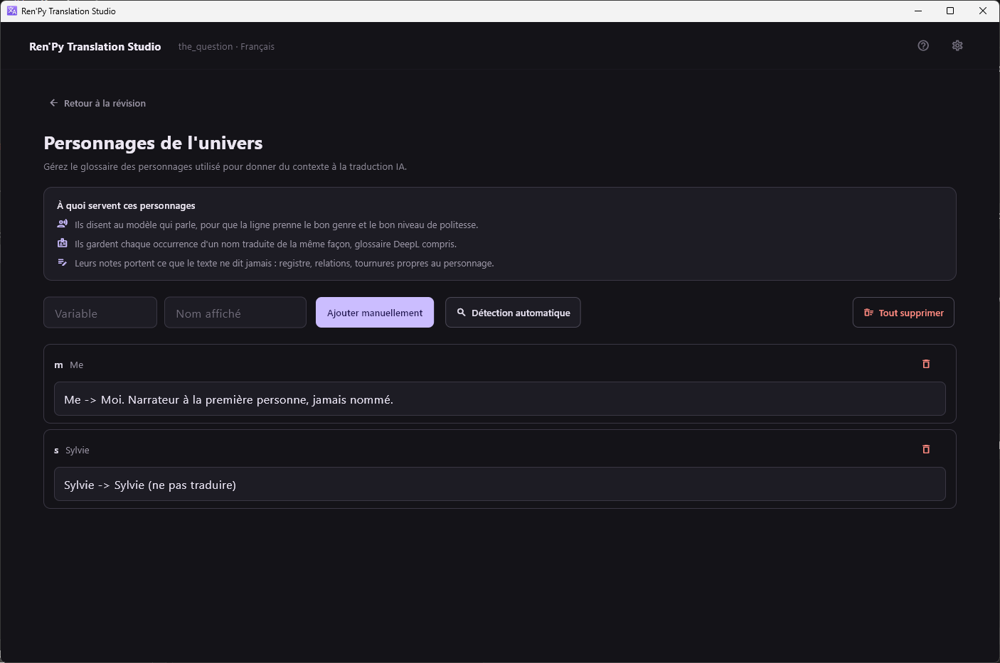
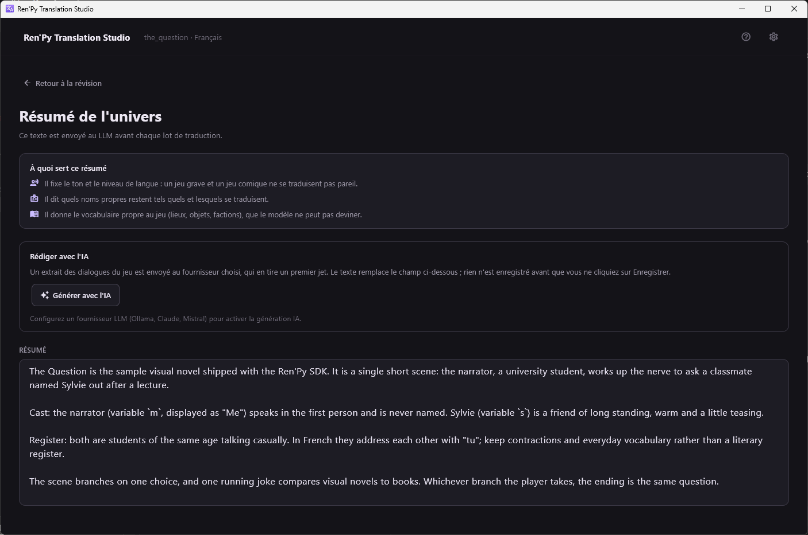

[← Documentation](README.md)

# Contexte pour l'IA

*[English version](../en/context-for-the-ai.md)*

Deux écrans donnent aux fournisseurs LLM ce que le texte seul ne peut pas
leur dire. Tous deux s'atteignent depuis la barre d'outils de la révision,
et tous deux valent dix minutes avant de lancer une longue traduction.

## Glossaire des personnages



**Détection automatique** parcourt les sources `.rpy` du jeu à la recherche
des définitions `Character()` et remplit la liste. C'est une détection
heuristique : relisez ce qu'elle a trouvé. La relancer réécrit les noms
affichés avec ce que dit la source, mais laisse vos notes intactes.

Chaque entrée a une variable (`s`), un nom affiché (`Sylvie`) et une note
libre. Ce sont les notes qui font le vrai travail :

```
Sylvie -> Sylvie (ne pas traduire)
Me -> Moi. Narrateur à la première personne, jamais nommé.
```

Elles servent de trois façons :

- Elles disent au modèle **qui parle**, pour que la ligne tombe avec le bon
  genre et le bon niveau de politesse.
- Elles gardent un nom **traduit de la même façon partout**. Avec DeepL,
  les notes écrites `Nom -> Traduction` deviennent un véritable glossaire
  côté serveur.
- Elles portent **ce que le texte ne dit jamais** : registre, relations,
  tournures propres au personnage.

## Résumé d'univers



Texte libre, envoyé au LLM avant chaque lot. Trois choses y ont leur place :

- **Le ton et le registre.** Un jeu grave et une comédie ne se traduisent
  pas pareil, et un lot de dix lignes sans lien ne donne au modèle aucun
  moyen de deviner lequel des deux il a sous les yeux.
- **Quels noms propres restent tels quels** et lesquels se traduisent.
- **Le vocabulaire propre au jeu** — lieux, objets, factions — qu'aucun
  modèle ne peut deviner.

**Générer avec l'IA** envoie un extrait des dialogues du jeu au fournisseur
LLM configuré et en tire un premier jet. Le texte remplace le champ ; rien
n'est enregistré tant que vous n'avez pas cliqué sur Enregistrer. Le bouton
reste désactivé tant qu'aucun fournisseur LLM n'est configuré, la traduction
automatique ne sachant pas le faire.

> La génération envoie du texte du jeu à un service tiers, et l'application
> vous demande de le confirmer à chaque fois.

### À propos d'un glossaire de termes

Il n'existe volontairement pas de glossaire de termes distinct, hors
personnages : aucun besoin mesuré ne l'a justifié jusqu'ici. Si vous voulez
faire respecter une terminologie récurrente, écrivez-la dans le résumé
d'univers — il part déjà dans le prompt système des trois LLM.
