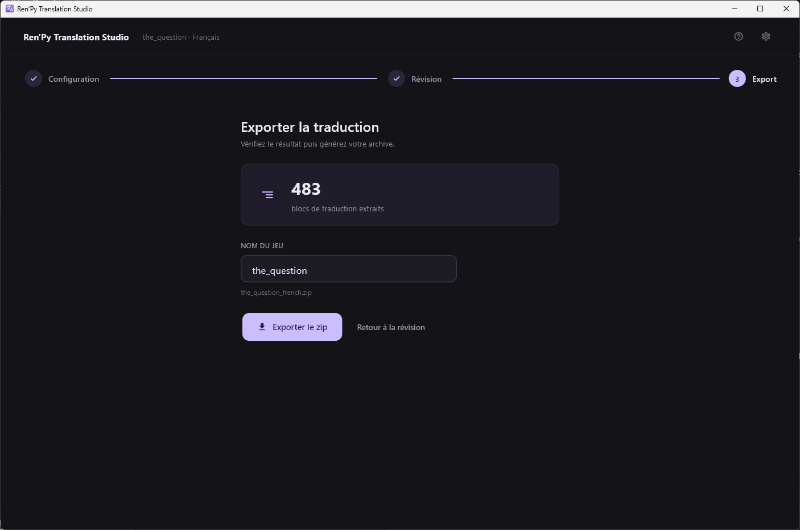

[← Documentation](README.md)

# Export

*[English version](../en/export.md)*

Deux étapes distinctes : écrire les fichiers `.rpy`, puis les empaqueter
dans un zip.

## Écrire les fichiers .rpy

**Enregistrer dans les .rpy**, dans la barre d'outils de la révision. Le
compteur orange à côté indique combien de modifications n'existent encore
que dans la base.

L'écriture réécrit `game/tl/<langue>/`, en appariant les blocs de dialogue
par leur **identifiant de bloc** Ren'Py et les blocs `strings` par leur
texte `old` — jamais par position. Les fichiers sont sauvegardés avant
modification.

C'est cette étape qui rend la traduction réelle : tout ce qui précède vit
dans `<jeu>/.rts/translations.db`, dont Ren'Py ignore l'existence. Toute
ligne portant du texte est écrite, quel que soit son
[statut](translation-statuses.md).

## Le zip

Accessible depuis la **troisième étape de la barre de progression**, en
haut de l'écran de révision. Les deux premières ramènent en arrière,
celle-là mène en avant.



L'archive a la structure qu'un joueur s'attend à déposer dans un jeu :

```
<nom du jeu>/game/tl/<langue>/
```

**Nom du jeu** est lu depuis `build.name` dans le `options.rpy` du jeu, à
défaut le nom du dossier, puis assaini pour être sûr dans un chemin. Le nom
de fichier proposé est affiché sous le champ.

Les fichiers `.rpyc` sont exclus : c'est la sortie compilée de Ren'Py, que
le moteur régénère. Toute entrée dont le chemin contient `../` est refusée
plutôt qu'écrite.

Quitter la révision est refusé tant qu'un travail de traduction tourne :
annulez-le ou laissez-le finir avant d'exporter.

## L'envoyer

Le dossier `tl/` produit part chez les joueurs du jeu : c'est pour cela que
les [contrôles qualité](troubleshooting.md) sur les interpolations sont des refus
et non des avertissements. Ren'Py évalue ce qui se trouve entre crochets
comme une expression Python.
