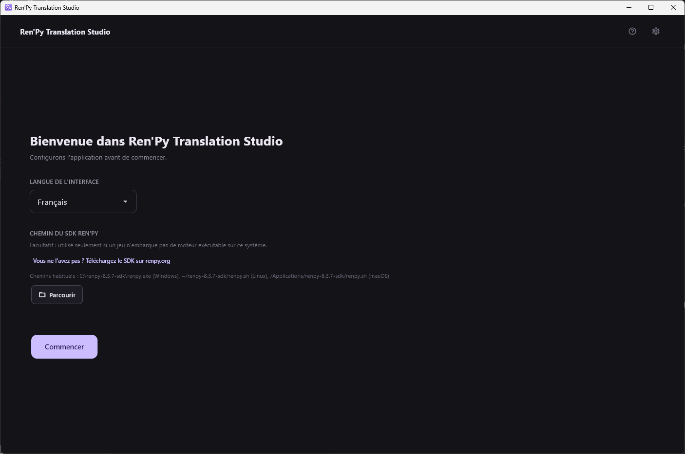
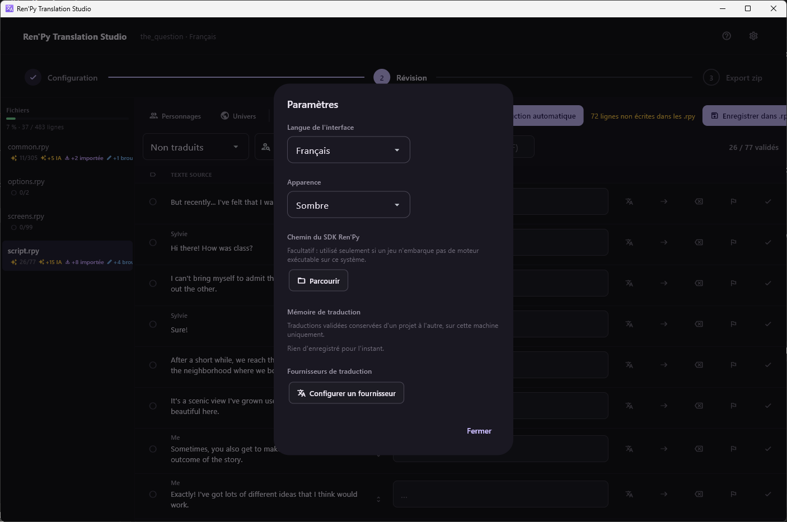

[← Documentation](README.md)

# Installation

*[English version](../en/installation.md)*

## Ce qu'il faut

- **Python 3.12 ou plus récent.**
- **[uv](https://docs.astral.sh/uv/)**, qui gère les dépendances et
  l'environnement virtuel. Ne jamais appeler `pip` directement dans ce
  projet.
- **Un moteur Ren'Py pour extraire.** Vous en avez sans doute déjà un :
  voir plus bas.
- **Un compte ou un point d'accès de fournisseur**, seulement si vous
  voulez de la traduction automatique ou LLM. L'application est
  parfaitement utilisable comme simple outil de révision sans aucun.

### À propos du moteur Ren'Py

L'extraction lance la commande `translate` de Ren'Py : il faut donc que
quelque chose fournisse cette commande. Deux sources, dans cet ordre :

1. **Le moteur embarqué dans le jeu.** Un jeu Ren'Py packagé embarque son
   propre moteur, dans la version exacte pour laquelle ses sources ont été
   écrites. C'est le bon par construction, et c'est celui qui est utilisé
   dès que ce système peut l'exécuter.
2. **Un SDK Ren'Py installé**, en recours. Nécessaire quand le moteur du
   jeu ne peut pas tourner ici — un build `-win` ouvert depuis Linux, par
   exemple, puisqu'il ne contient que des runtimes Windows.

Le SDK est donc **facultatif**. Renseignez-le plus tard, depuis le
dialogue des paramètres, si un jeu finit par le réclamer.

> La version compte. Ren'Py 8 refuse une syntaxe d'écran que Ren'Py 7
> acceptait, et chaque fichier source refusé retire ses lignes de
> l'extraction. Mesuré sur un vrai jeu : le SDK 8.5.3 a rejeté 3 sources
> et produit 40 739 unités, là où le moteur 7.5.3 du jeu n'en a rejeté
> aucune et produit 40 820.

> Lancer le moteur du jeu, c'est exécuter du code tiers — l'exécutable même
> que vous lanceriez pour jouer. N'extrayez que des jeux que vous
> accepteriez de lancer.

## Installer

```bash
git clone https://github.com/lambda-vn/renpy-translation-studio.git
cd renpy-translation-studio
uv sync
```

`uv` crée `.venv` à la racine au premier `uv sync` ou `uv run`. Ne
l'activez pas à la main et ne le committez pas.

## Lancer

```bash
uv run flet run src/main.py
```

## Premier lancement



Deux choses sont demandées, et les deux se changent ensuite :

- **Langue de l'interface** — anglais ou français.
- **Chemin du SDK Ren'Py** — facultatif, comme expliqué plus haut.
  Laissez-le vide jusqu'à ce qu'un jeu en ait besoin.

Tout le reste se règle depuis l'icône d'engrenage en haut à droite, sur
tous les écrans.



Le réglage **Apparence** bascule entre sombre, clair et suivi du système,
et s'applique immédiatement. Les clés API ne sont pas stockées dans ce
fichier : elles vont dans le trousseau du système d'exploitation.

## Ou bien un binaire packagé

Les binaires Windows, macOS et Linux sont produits par le workflow
**Build** du dépôt, un runner par cible, et publiés en artefacts. C'est le
chemin normal pour obtenir une application packagée ; compiler en local
avec `uv run python scripts/build.py` ne produit jamais que la cible du
système courant, `flet build` ne sachant pas compiler en croisé.

Ces binaires ne sont pas signés : SmartScreen et Gatekeeper avertiront.
