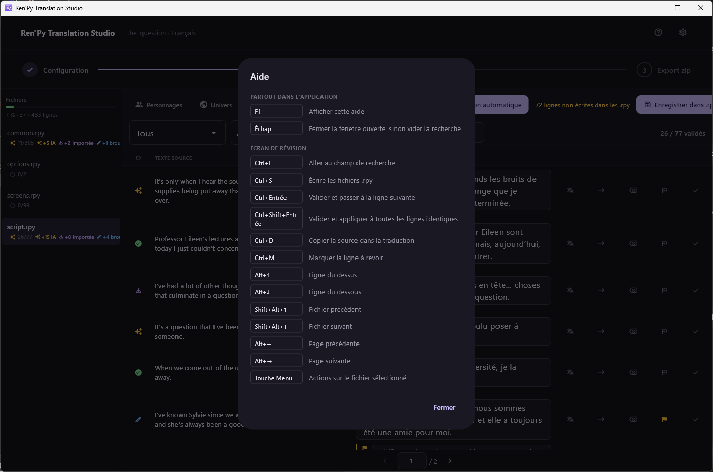

[← Documentation](README.md)

# Raccourcis clavier

*[English version](../en/keyboard-shortcuts.md)*

`F1` affiche cette liste dans l'application, depuis n'importe quel écran.

## Partout

| Touche | Action |
|---|---|
| `F1` | Afficher la liste des raccourcis |
| `Échap` | Fermer la fenêtre ouverte, sinon vider la recherche |

## Écran de révision

| Touche | Action |
|---|---|
| `Ctrl+F` | Aller au champ de recherche |
| `Ctrl+S` | Écrire les fichiers `.rpy` |
| `Ctrl+Entrée` | Valider et passer à la ligne suivante |
| `Ctrl+Maj+Entrée` | Valider et appliquer à toutes les lignes identiques |
| `Ctrl+D` | Copier la source dans la traduction |
| `Ctrl+M` | Marquer la ligne pour un second regard |
| `Alt+↑` / `Alt+↓` | Ligne au-dessus / en dessous |
| `Maj+Alt+↑` / `Maj+Alt+↓` | Fichier précédent / suivant |
| `Alt+←` / `Alt+→` | Page précédente / suivante |
| Touche `Menu` | Actions sur le fichier sélectionné |

## Remarques

`Ctrl+Maj+Entrée` est celui à retenir sur un jeu plein de répliques
répétées — un `"..."`, un `"Oui."`, un libellé de menu qui revient à vingt
endroits.

Les raccourcis se déclenchent même quand un champ de texte a le focus :
vous n'avez donc jamais à quitter la traduction que vous êtes en train
d'écrire pour la valider.

Toute l'application se pilote au clavier, et les statuts portent un glyphe
distinct et un libellé pour lecteur d'écran plutôt que de reposer sur la
couleur.
