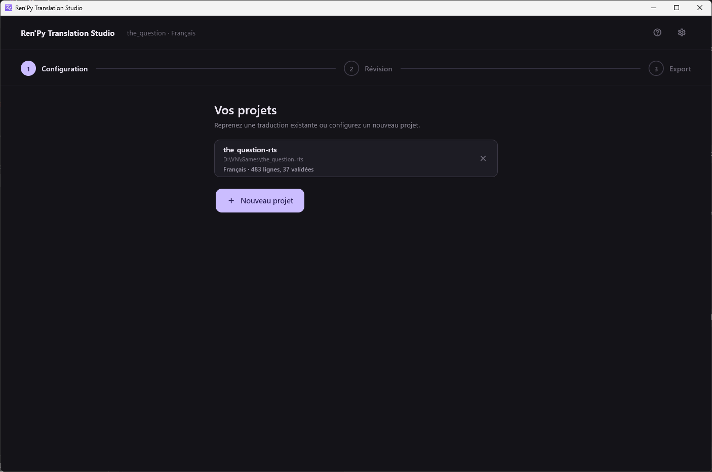
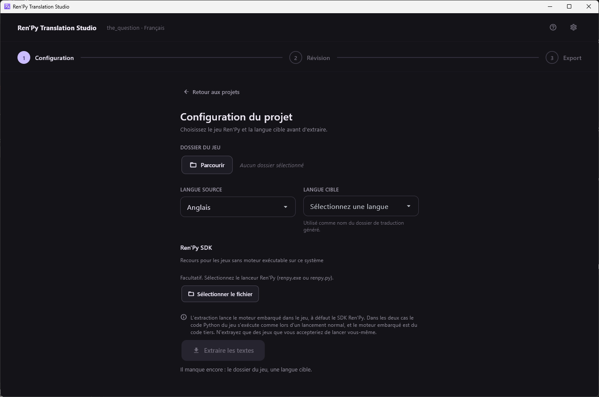

[← Documentation](README.md)

# Configuration du projet

*[English version](../en/project-setup.md)*

Le premier écran après le lancement. Il liste les jeux déjà configurés, ou
propose le formulaire pour en ajouter un.

## Vos projets

Chaque entrée montre le nom du dossier, son chemin, la langue cible et
l'avancement. Cliquer dessus rouvre le projet directement dans l'écran de
révision, sur le fichier, la page, le filtre et la recherche que vous aviez
laissés.

La croix retire l'entrée de la liste. Elle ne touche ni au dossier du jeu
ni aux traductions qu'il contient, et rajouter le dossier les retrouve.

Cette liste est aussi ce que le [serveur MCP](mcp-server.md) a le droit
d'ouvrir : un dossier qui n'y figure pas est inatteignable par un
assistant.

## Un nouveau projet

**Dossier du jeu** — la racine du jeu Ren'Py, le dossier qui *contient*
`game/`, et non `game/` lui-même.

**Langue source** — la langue dans laquelle le jeu est écrit. L'anglais
dans la quasi-totalité des cas.

**Langue cible** — la langue vers laquelle vous traduisez. C'est aussi le
nom du dossier que Ren'Py va générer, `game/tl/<langue>/`, donc ce doit
être une langue que Ren'Py connaît.

**SDK Ren'Py** — facultatif. Utilisé seulement si le jeu n'embarque pas de
moteur exécutable sur ce système. Voir [Installation](installation.md).

## L'extraction

**Extraire les textes** lance la commande `translate` de Ren'Py dans un
sous-processus. Ren'Py parcourt les scripts du jeu et écrit
`game/tl/<langue>/` ; l'application relit ces fichiers et enregistre une
ligne par bloc traduisible dans `<jeu>/.rts/translations.db`.

Comptez du temps sur un gros jeu : c'est le moteur du jeu qui analyse tout
le script, pas une recherche de texte.

### Ce qui peut mal se passer

- **Un fichier source est refusé.** Ren'Py signale une erreur d'analyse et
  les lignes de ce fichier sont simplement absentes de l'extraction.
  L'application nomme les fichiers refusés. C'est le symptôme classique
  d'un SDK Ren'Py 8 lisant un jeu Ren'Py 7.
- **Aucun moteur.** Ni le moteur du jeu ni un SDK configuré ne peuvent
  tourner ici. Le message dit lequel des deux manquait.

### Réextraire

Relancer l'extraction sur un projet qui en a déjà une **n'écrase jamais
votre travail**. Les blocs sont appariés par leur identifiant Ren'Py
stable, les nouveaux sont ajoutés, les traductions existantes restent en
place. Les lignes dont le texte source a changé dans le jeu sont
resynchronisées, et seules leurs traductions non relues sont abandonnées :
tout ce que vous aviez validé est conservé et signalé pour un second
regard.

## Où sont rangées les choses

| Quoi | Où |
|---|---|
| Traductions, statuts, notes | `<jeu>/.rts/translations.db` (SQLite) |
| Fichiers Ren'Py générés | `<jeu>/game/tl/<langue>/` |
| Paramètres, liste des projets, mémoire de traduction | Le dossier de configuration du système |
| Clés API | Le trousseau du système, jamais un fichier du dépôt |

La base vit dans le dossier du jeu : déplacer ou copier ce dossier emporte
donc toute la traduction. Elle est ouverte en mode WAL, ce qui permet à une
seconde fenêtre et au serveur MCP de travailler sur le même projet en même
temps ; deux fichiers annexes, `translations.db-wal` et `-shm`,
apparaissent à côté.
