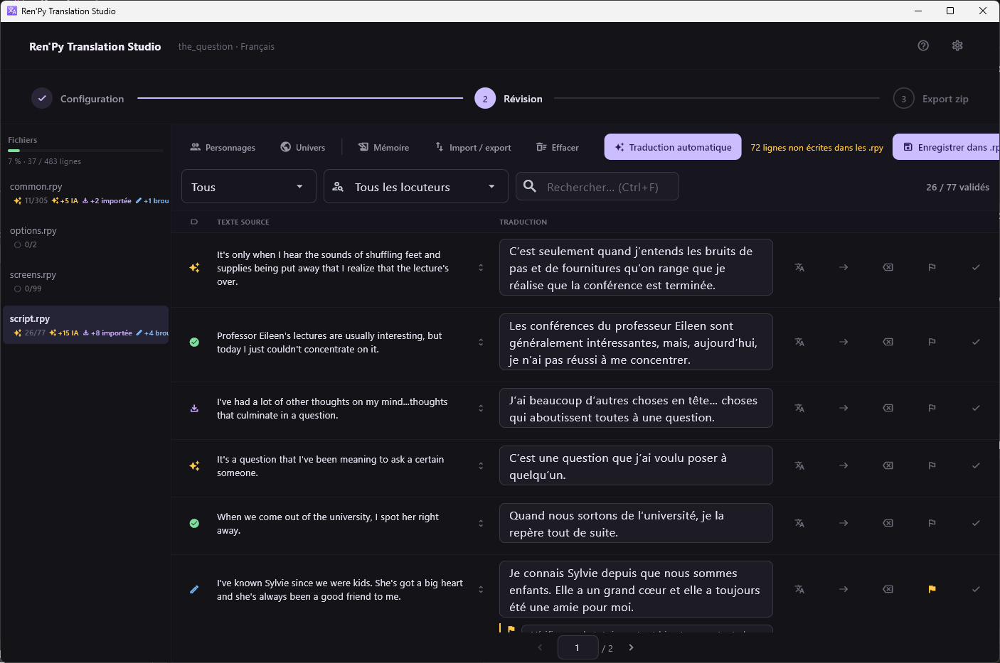
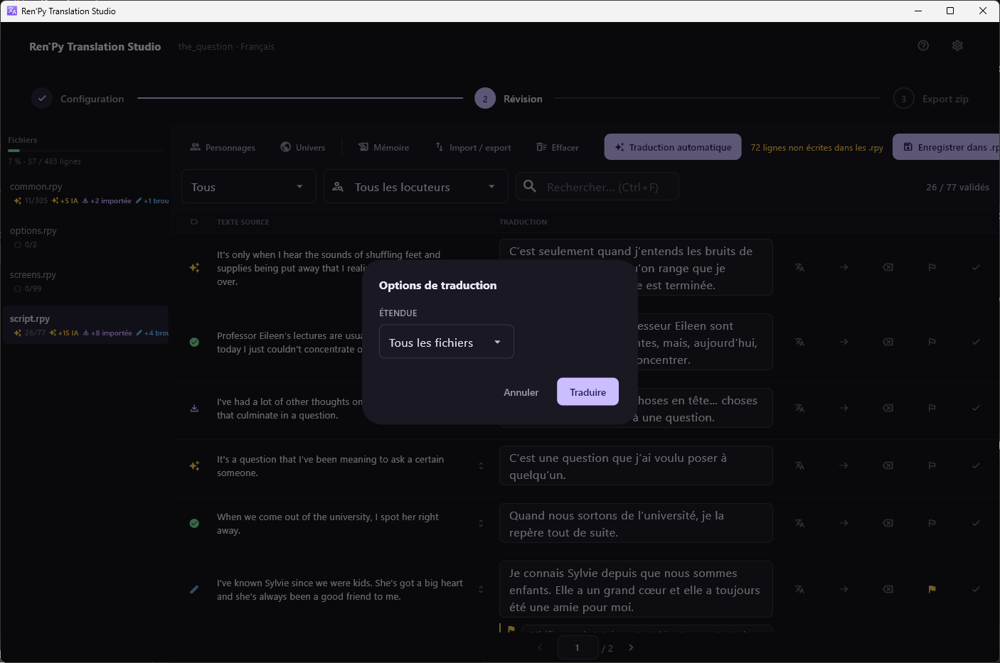

[← Documentation](README.md)

# Écran de révision

*[English version](../en/review-screen.md)*

C'est là que le travail se fait. Tout le reste de l'application s'atteint
depuis cet écran.

## Le panneau des fichiers

À gauche, une entrée par fichier `.rpy` produit par l'extraction, avec la
progression du projet entier au-dessus.

Chaque fichier porte ses compteurs : validées sur total, puis combien sont
des suggestions IA, des importées ou des brouillons. Un fichier à `0/99`
n'a pas été commencé ; `26/77` veut dire vingt-six lignes validées sur
soixante-dix-sept.

Un clic droit sur un fichier, ou la touche **Menu** quand il est
sélectionné, propose six actions sur ce seul fichier : l'ouvrir, copier son
chemin, le montrer dans l'explorateur, le traduire, l'envoyer en
[fichier bilingue](bilingual-files.md), ou effacer ses traductions.

`common.rpy` est en général le plus gros fichier et le moins intéressant :
il contient les chaînes d'interface de Ren'Py, pas les dialogues du jeu.

## Les filtres

**Statut** filtre les lignes. Au-delà des cinq statuts, il offre deux vues
supplémentaires : *À revoir*, pour les lignes marquées pour un second
regard, et *En erreur*, pour celles qu'un contrôle qualité a refusées.

**Locuteurs** filtre par personnage, à partir des noms de variables
trouvés dans les scripts du jeu. Pratique pour tenir le registre d'un
personnage, ou traduire toutes ses répliques d'affilée.

**Rechercher** (`Ctrl+F`) cherche dans le texte source *et* dans la
traduction : on retrouve donc aussi bien un terme qu'on a employé qu'un
terme qu'on cherche à traduire. `%` et `_` sont cherchés littéralement.

Le compteur de droite — `26 / 77 validés` — décrit toujours le fichier
courant, pas le filtre.

## Les lignes

Chaque ligne est un bloc traduisible : son glyphe de statut, le locuteur,
le texte source, et le champ où vous écrivez.

Les cinq icônes de droite, dans l'ordre :

| Icône | Action | Raccourci |
|---|---|---|
| Traduire | Traduire cette seule ligne avec le fournisseur configuré | |
| Flèche | Copier le texte source dans la traduction | `Ctrl+D` |
| Effacer | Vider la traduction | |
| Drapeau | Marquer la ligne pour un second regard | `Ctrl+M` |
| Coche | Valider | `Ctrl+Entrée` |

Valider avec `Ctrl+Maj+Entrée` applique en plus la même traduction à toutes
les autres lignes dont le texte source est identique, ce qui économise
beaucoup de frappe sur un jeu plein de répliques répétées.

Une ligne signalée peut porter une **note**, affichée sous le champ dans
la bande jaune. Les notes servent à ce que le texte ne dit pas de lui-même :
un registre à vérifier, un terme à garder cohérent, une ligne dont le sens
dépend d'une branche. Ni le drapeau ni la note ne sont jamais touchés par
un travail de traduction ou un import — seulement par une personne.

Sous une traduction peut aussi apparaître un **avertissement qualité**, du
genre *Traduction 32% plus longue que le texte source*. Ceux-là sont
indicatifs. Les bloquants sont décrits dans le [Dépannage](troubleshooting.md).

## La barre d'outils

**Personnages** et **Univers** ouvrent les deux écrans décrits dans
[Contexte pour l'IA](context-for-the-ai.md).

**Mémoire** remplit les lignes non traduites depuis la
[mémoire de traduction](bilingual-files.md#mémoire-de-traduction).

**Import / export** fait l'aller-retour en
[fichier bilingue](bilingual-files.md).

**Effacer** supprime des traductions en masse, avec confirmation.

**Traduction automatique** lance un travail de fond sur tout le projet ou
sur le fichier courant.

Un travail en cours rend compte dans un bandeau et non dans une fenêtre
modale : la révision reste utilisable pendant ce temps. Il n'envoie que les
lignes encore `non traduites`, ce qui rend sûre la correction manuelle
d'une mauvaise suggestion : un travail ultérieur ne l'écrasera pas, et ne
la retentera pas non plus.

**Enregistrer dans les .rpy** réécrit tout dans `game/tl/<langue>/`. Le
compteur orange à côté — *72 lignes non écrites dans les .rpy* — indique
combien de modifications ne sont encore que dans la base. Rien n'est perdu
si vous partez sans enregistrer ; les fichiers sur disque ne sont
simplement pas à jour.

## Quitter l'écran

La barre de progression du haut est la sortie dans les deux sens : les deux
premières étapes ramènent à la
[configuration du projet](project-setup.md), la troisième mène à
l'[export](export.md).

Revenir à la configuration demande confirmation, et les traductions restent
enregistrées dans les deux cas. La navigation est refusée tant qu'un travail
de traduction tourne : annulez-le ou laissez-le finir.
