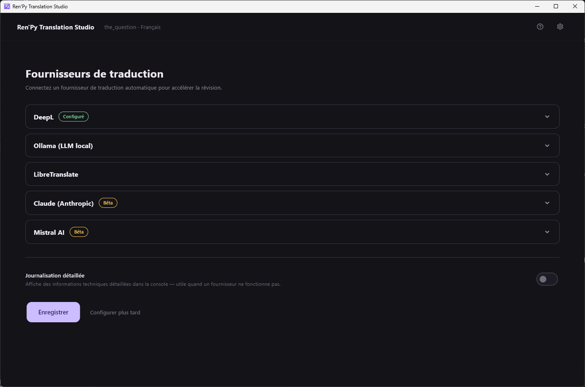
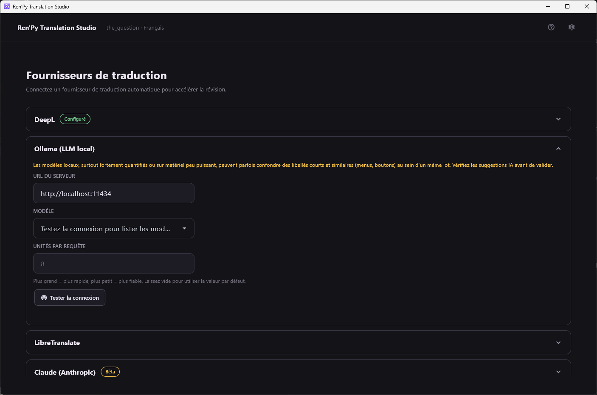

[← Documentation](README.md)

# Fournisseurs de traduction

*[English version](../en/translation-providers.md)*

Cinq fournisseurs, accessibles depuis l'engrenage puis **Configurer un
fournisseur**.

| Fournisseur | Type | Tourne | Demande |
|---|---|---|---|
| [DeepL](https://www.deepl.com) | Traduction automatique | Cloud | Clé API |
| [Ollama](https://ollama.com) | LLM | Local, ou les modèles cloud d'Ollama | Un modèle téléchargé |
| [LibreTranslate](https://libretranslate.com) | Traduction automatique | Cloud ou auto-hébergé | URL, clé si l'instance en demande une |
| [Claude](https://www.anthropic.com) | LLM | Cloud | Clé API |
| [Mistral](https://mistral.ai) | LLM | Cloud | Clé API |

Le badge vert **Configuré** signifie qu'une clé ou un point d'accès est
enregistré. **Bêta** sur Claude et Mistral veut dire exactement ce qui est
écrit : ces deux-là n'ont jamais été testés contre la véritable API.

**Aucun fournisseur est une configuration valable.** L'application est
d'abord un outil de révision ; le [serveur MCP](mcp-server.md) est
l'autre façon de faire traduire du texte sans clé API ni GPU.

## Traduction automatique ou LLM

**DeepL et LibreTranslate** traduisent une chaîne à la fois. Ils sont
rapides, peu chers et prévisibles, et ils ne savent rien de votre jeu :
aucun registre de personnage, aucun terme récurrent, aucune idée de qui
parle.

**Ollama, Claude et Mistral** reçoivent le
[résumé d'univers et le glossaire des personnages](context-for-the-ai.md)
à chaque lot : ils peuvent donc tenir un registre et garder un nom propre
cohérent. Ils sont plus lents, plus chers, et ils peuvent inventer.

DeepL est le seul à gérer un **glossaire côté serveur** : les notes de
personnage écrites `Nom -> Traduction` sont envoyées comme un vrai
glossaire DeepL, synchronisé paresseusement au premier lot.

Seuls les trois LLM peuvent rédiger le
[résumé d'univers](context-for-the-ai.md) à votre place.

## Ollama

**URL du serveur** — `http://localhost:11434` sauf si vous l'avez déplacé.

**Modèle** — appuyez d'abord sur **Tester la connexion** ; la liste
déroulante affiche ensuite ce que le démon possède réellement. Les modèles
cloud d'Ollama passent par le même point d'accès local, le démon signant
lui-même la requête : ce sont juste d'autres noms dans cette liste, et ils
demandent `ollama signin` plutôt qu'une clé ici.

**Unités par requête** — plus grand = plus rapide, plus petit = plus
fiable. Laissez vide pour la valeur par défaut.

> L'avertissement affiché dans ce panneau n'est pas décoratif. Les modèles
> locaux fortement quantifiés, ou du matériel modeste, confondent
> réellement des libellés courts et similaires — entrées de menu, textes de
> boutons — au sein d'un même lot. Réduisez la taille du lot et relisez les
> suggestions IA avant de valider.

Un modèle local demande un GPU pour être confortable. Sur CPU il marchera,
et il sera lent.

## Les clés API

Les clés sont stockées dans le **trousseau du système d'exploitation**, ni
dans le fichier de paramètres ni dans le dépôt. Elles ne sont jamais
journalisées, même partiellement, ni incluses dans un message d'erreur.

## Journalisation détaillée

L'interrupteur en bas de l'écran des fournisseurs fait journaliser à chacun
ses requêtes et ses réponses en niveau DEBUG. C'est la première chose à
activer quand une traduction revient fausse ou qu'une connexion échoue.

## Ajouter un fournisseur

Les fournisseurs implémentent un petit protocole structurel :
`translate_batch()` et `test_connection()`, plus deux capacités
optionnelles — un glossaire serveur, et la complétion libre pour le résumé
d'univers. En ajouter un demande un module dans
`src/core/translation/providers/`, une entrée dans le registre, ses clés
dans les valeurs par défaut des paramètres, sa section dans l'écran des
fournisseurs, son libellé dans l'écran de révision, ses chaînes dans les
deux locales, et un fichier de tests mocké. Voir
[CLAUDE.md](../../CLAUDE.md).
