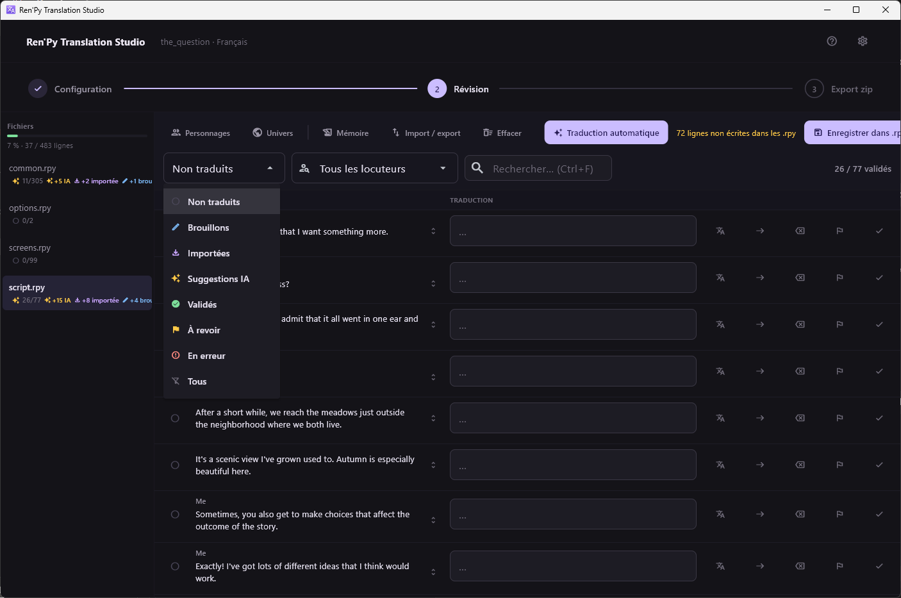
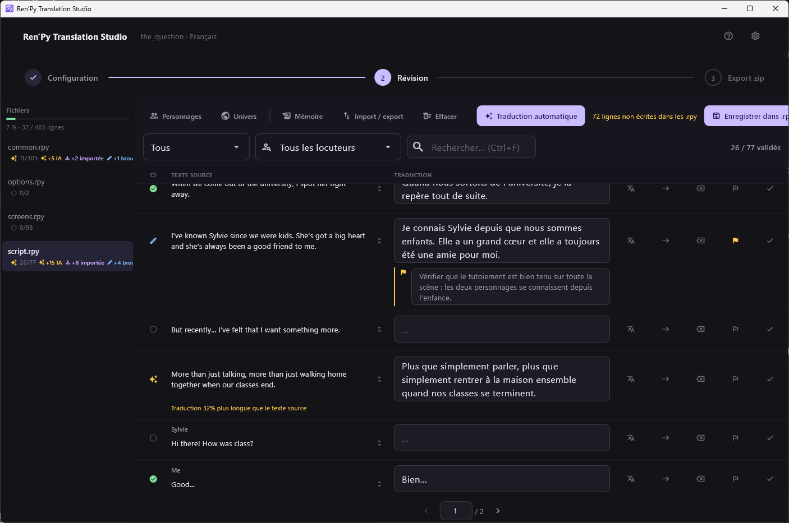

[← Documentation](README.md)

# Statuts de traduction

*[English version](../en/translation-statuses.md)*

Chaque ligne porte exactement un statut parmi cinq, plus un drapeau
indépendant.

## Les cinq statuts

| Statut | Sens | Posé par |
|---|---|---|
| **Non traduit** | Pas encore de traduction | L'extraction |
| **Brouillon** | Édité à la main, non validé | Vous, en tapant |
| **Importée** | Vient d'ailleurs, non relue ici | Import de fichier bilingue, mémoire de traduction |
| **Suggestion IA** | Un fournisseur ou un assistant l'a proposée | Un travail de traduction, le serveur MCP |
| **Validé** | Un humain l'a lue et a dit oui | Vous, `Ctrl+Entrée` |

C'est une chaîne, grosso modo `non traduit → suggestion IA → validé`, avec
`brouillon` et `importée` comme deux entrées latérales.

## Les règles qui comptent

**Une ligne validée n'est jamais écrasée.** Ni par un travail de
traduction, ni par un import, ni par la mémoire de traduction, ni par une
soumission du serveur MCP. La seule chose qui puisse dévalider une ligne,
c'est vous en tapant dans son champ, ce qui la passe en brouillon.

**Les travaux ne touchent que les lignes non traduites.** Un travail de
traduction n'envoie rien d'autre. Une mauvaise suggestion IA reste donc
mauvaise tant que personne ne s'en occupe — relancer le travail ne la
retentera pas. Effacez-la, corrigez-la, ou filtrez sur *Suggestions IA* et
passez-les en revue.

**Vider un champ réinitialise la ligne.** Un brouillon dont vous supprimez
le texte repasse en `non traduit`, ce qui le remet à portée du prochain
travail.

## Drapeau et note

À côté du statut vivent un **drapeau** — *à revoir* — et une **note**
facultative. Ce ne sont volontairement pas des statuts :

- Ils survivent à tout. Un travail, un import, une réextraction : aucun
  n'efface un drapeau ni une note.
- Ils sont orthogonaux à l'avancement. Une ligne peut être signalée alors
  qu'elle est non traduite, validée, ou entre les deux.
- Écrire une note lève le drapeau automatiquement. Rien ne liste les notes
  isolément : une note sans drapeau ne serait retrouvable que par qui se
  souviendrait de la ligne qui la porte.

Filtrez sur *À revoir* pour les traiter.

## Où les statuts apparaissent

- **Dans le panneau des fichiers**, sous forme de compteurs par fichier.
- **Dans la ligne**, sous forme du glyphe de la colonne de gauche. Chacun a
  une forme distincte et un libellé pour lecteur d'écran : l'information ne
  dépend jamais de la seule couleur.
- **Dans l'export**, indirectement : tout ce qui porte du texte est écrit
  dans les fichiers `.rpy`, quel que soit son statut. Les statuts décrivent
  votre confiance, pas ce qui est livré.
